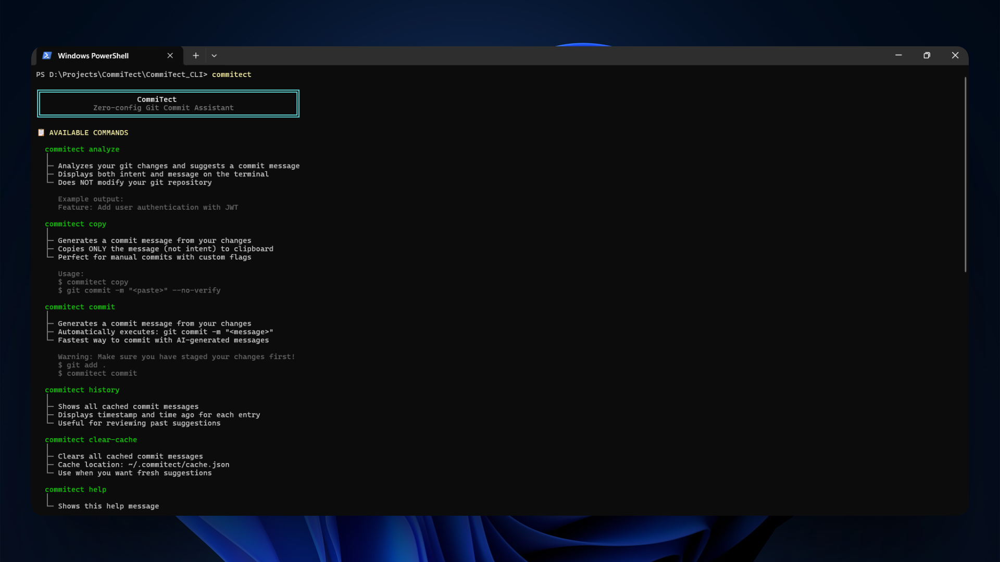
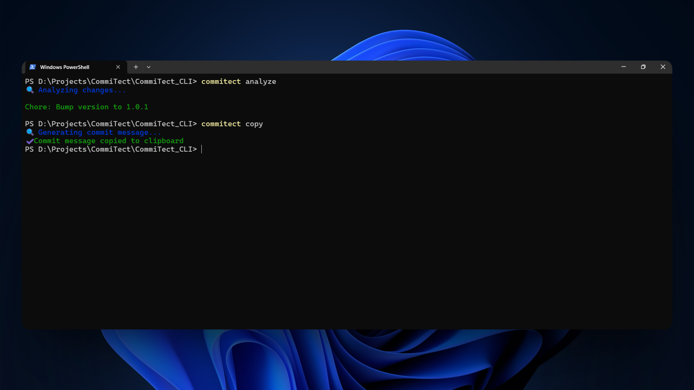
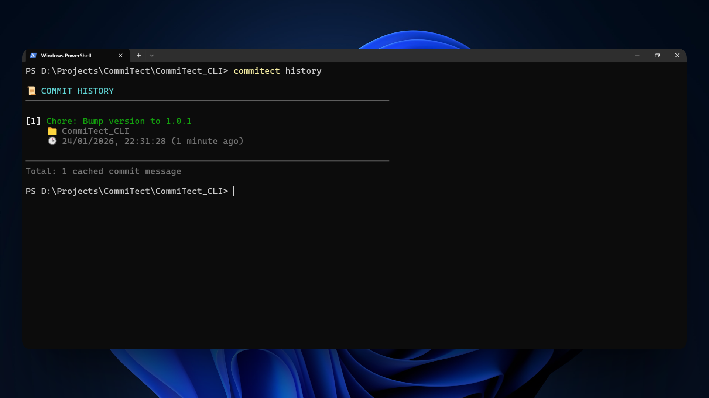
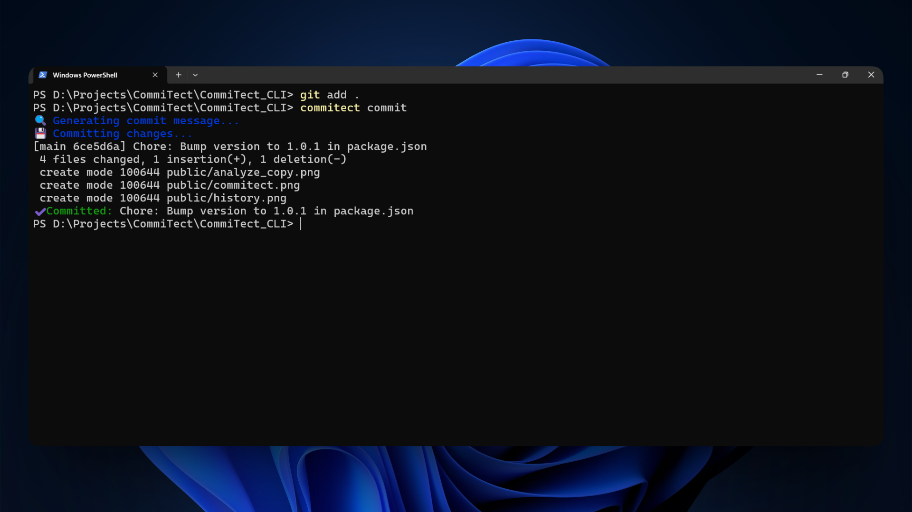

# CommiTect

**Zero-config Git Commit Assistant CLI** powered by custom LLM API.

## Features

✅ **Zero Configuration** - Works out of the box  
✅ **AI-Powered** - Generates professional commit messages  
✅ **Fast** - Instant analysis and suggestions  
✅ **Smart Caching** - Avoids redundant API calls  
✅ **History Tracking** - Review all your cached messages  
✅ **Simple** - Just 5 commands

## Screenshots






## Installation

```bash
npm install -g commitect
```

## Usage

### Analyze Changes

Generate and display a commit message suggestion:

```bash
commitect analyze
```

**Output:**
```
Feature: Add user authentication with JWT tokens
```

### Copy to Clipboard

Generate a commit message and copy it to your clipboard:

```bash
commitect copy
```

**Output:**
```
✔ Commit message copied to clipboard
```

### Auto-Commit

Generate a commit message and execute the git commit automatically:

```bash
commitect commit
```

**Output:**
```
✔ Committed: Feature: Add user authentication with JWT tokens
```

### View History

View all cached commit messages:

```bash
commitect history
```

**Output:**
```
📜 COMMIT HISTORY
──────────────────────────────────────────────────────────────────────

[1] Feature: Add user authentication with JWT tokens
    📁 CommiTect_VSCode
    🕒 24/01/2026, 20:18:58 (4 minutes ago)

[2] Bug Fix: Resolve memory leak in connection pool
    📁 CommiTect_VS
    🕒 24/01/2026, 20:00:58 (22 minutes ago)

──────────────────────────────────────────────────────────────────────
Total: 2 cached commit messages
```

### Clear Cache

Clear the cached commit messages:

```bash
commitect clear-cache
```

**Output:**
```
✔ Cache cleared (15 entries removed)
```

## How It Works

1. **Reads git diff** - Analyzes both staged and unstaged changes
2. **Checks cache** - If the same diff was processed before, returns cached result instantly
3. **Filters noise** - Ignores `node_modules/`, `dist/`, `build/`, etc.
4. **Generates message** - Uses your custom LLM API with automatic retry
5. **Caches result** - Stores the result for 30 days to avoid redundant API calls
6. **Executes action** - Display, copy, or commit based on command

## Requirements

- Node.js >= 16
- Git repository
- Internet connection (for API calls)

## Workflow

```bash
# Make your changes
vim src/auth.ts

# Save files
git add .

# Generate and commit
commitect commit

# Continue with your workflow
git push
```

## Caching System

CommiTect intelligently caches commit messages to improve performance:

- **Fast responses** - Cached results return instantly without API calls
- **30-day retention** - Cache entries expire after 30 days
- **Hash-based** - Uses SHA-256 hash of git diff for accurate matching
- **Persistent** - Cache stored in `~/.commitect/cache.json`
- **Manual clear** - Use `commitect clear-cache` to reset

### Cache Benefits

1. **Faster execution** - No API latency for repeated diffs
2. **Reduced API costs** - Fewer API calls = lower costs
3. **Offline capability** - Works offline if result is cached
4. **Consistency** - Same diff always produces same message

## API Integration

CommiTect connects to your LLM API with:
- **Automatic retry** - Retries failed requests up to 3 times
- **Rate limit handling** - Graceful exponential backoff
- **Network resilience** - Handles timeouts and connection errors
- **Smart caching** - Reduces API calls significantly

## Ignored Paths

The following directories are automatically excluded from analysis:

- `node_modules/`
- `bin/`
- `obj/`
- `dist/`
- `build/`
- `.git/`

## Commit Message Rules

Generated messages follow best practices:
- **Under 70 characters**
- **Imperative form** (Add, Fix, Update, Refactor)
- **Professional and concise**
- **Contextual** based on actual changes

## License

MIT